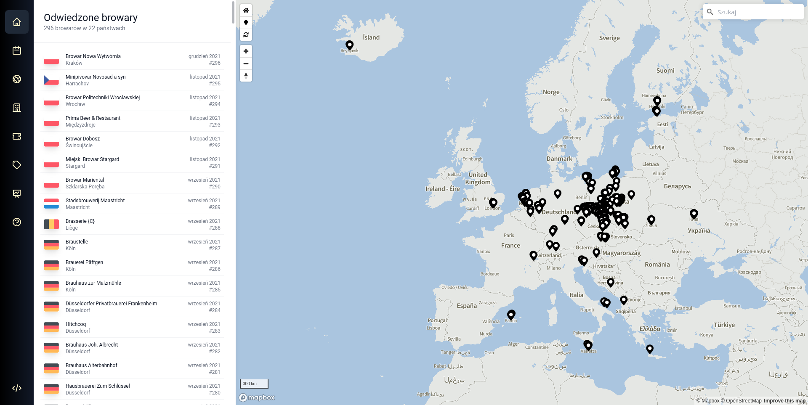
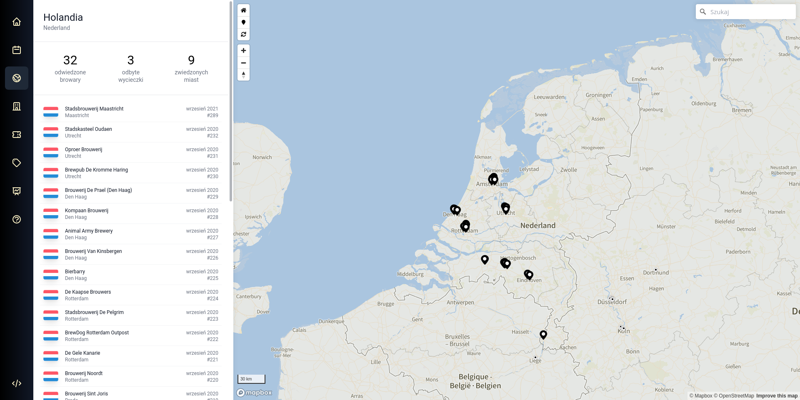
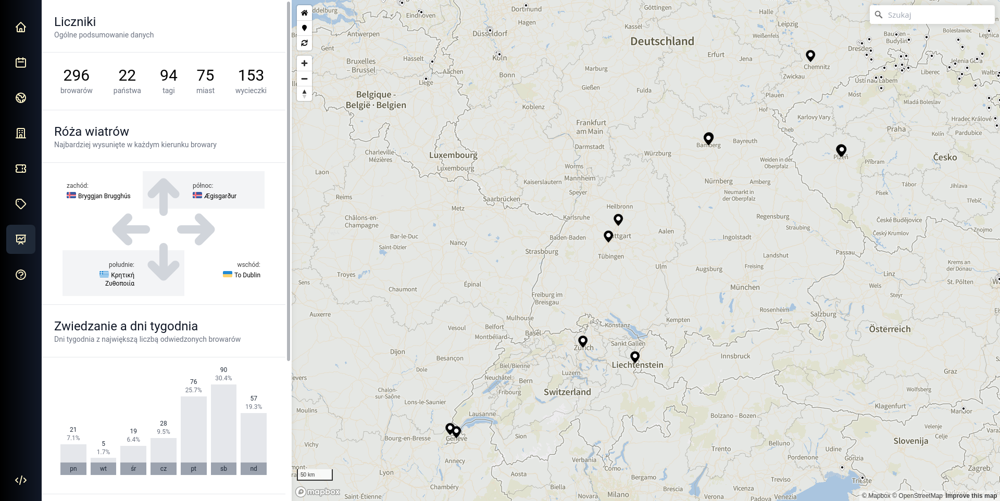

## Browary
**Browary** is a simple application for building an interactive map with visited breweries. It uses custom static API generator written in PHP to deliver a blazing fast backend. 

### Screenshots

> General view


> Visited country summary page


> Statistics page

## Usage
Clone this repository and set up environment configuration in `.env` file:
```
git clone https://github.com/krzysztofrewak/browary
cd browary
cp .env.example .env
```

Run containerized environment:
```
docker compose up -d
```

Install frontend dependencies and build frontend:
```
docker compose exec node npm install
docker compose exec node npm run build
```

Install backend dependencies and build static API endpoints:
```
docker compose exec php composer install
docker compose exec php composer build
```

Application should be available under `localhost:8037` or other port if you changed `EXTERNAL_WEBSERVER_PORT` value in `.env` file.


### Development
Run frontend in development mode:
```
docker compose exec node npm run serve
```

### Deployment
There is a GitHub Actions workflow to deploy build application on GitHub Pages. You can also copypaste build `public` directory to your webserver.
